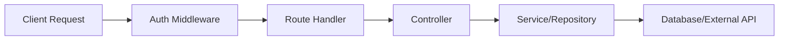
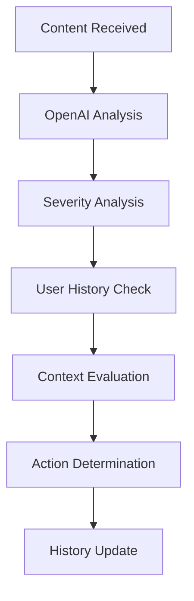

# Architecture Overview

## System Architecture

The Galaxy Moderation API follows a modular, layered architecture pattern with clear separation of concerns:

```
src/
├── config/         # Configuration and environment setup
├── controllers/    # Request handlers and business logic
├── middleware/     # Authentication and request processing
├── models/         # Data models and constants
├── repositories/   # Data access layer
├── routes/         # API route definitions
└── services/       # External service integrations
```

## Core Components

### 1. Content Moderation Engine
- Located in `src/controllers/moderationController.js`
- Handles content analysis and action determination
- Features:
  - Severity analysis across multiple categories
  - Context-aware moderation decisions
  - User history consideration
  - Action escalation based on previous infractions

### 2. Authentication System
- Located in `src/middleware/authMiddleware.js`
- Provides:
  - API key validation
  - OAuth integration
  - Session management
  - User identification

### 3. Data Layer
- MongoDB-based storage
- Repositories:
  - UserHistory: Tracks user moderation history
  - ChatMessage: Stores message content and moderation results
  - OAuthClient: Manages OAuth client credentials

### 4. OpenAI Integration
- Located in `src/services/openAIService.js`
- Handles:
  - Communication with OpenAI's moderation API
  - Response processing
  - Error handling

## Data Flow

1. **Request Processing**


2. **Moderation Flow**


## Key Design Patterns

1. **Repository Pattern**
- Abstracts data access
- Centralizes data operations
- Example: `userHistoryRepository.js`

2. **Service Layer**
- Encapsulates external service interactions
- Provides clean interfaces
- Example: `openAIService.js`

3. **Middleware Chain**
- Sequential request processing
- Authentication and validation
- Example: `authMiddleware.js`

4. **Controller-Service Pattern**
- Separates business logic from request handling
- Improves testability and maintainability
- Example: `moderationController.js`

## Configuration Management

- Environment-based configuration
- Centralized config object
- Flexible threshold management
- Located in `src/config/config.js`

## Security Architecture

1. **Authentication Layer**
- API key validation
- OAuth support
- Session management

2. **Request Validation**
- Input sanitization
- Parameter validation
- Rate limiting

3. **Error Handling**
- Centralized error processing
- Environment-aware error responses
- Secure error logging

## Scalability Considerations

1. **Database Operations**
- Indexed collections
- Efficient query patterns
- Pagination support

2. **API Design**
- RESTful endpoints
- Stateless operations
- Cache-friendly responses

3. **Resource Management**
- Connection pooling
- Rate limiting
- Request timeouts

## Monitoring and Logging

- Request logging
- Error tracking
- Performance metrics
- Moderation analytics

## Future Extensibility

The architecture supports future enhancements:

1. **New Moderation Sources**
- Pluggable moderation services
- Multiple AI provider support
- Custom rule engines

2. **Additional Features**
- Real-time notifications
- Automated appeals
- Advanced analytics

3. **Integration Options**
- Webhook support
- Event streaming
- Custom plugins
